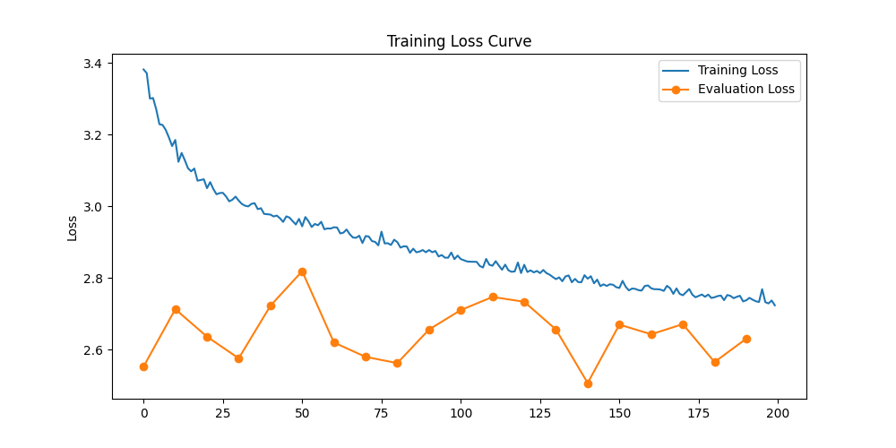
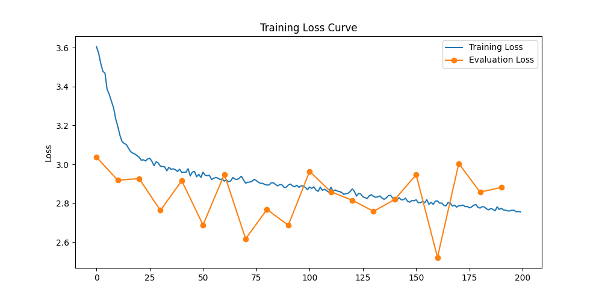
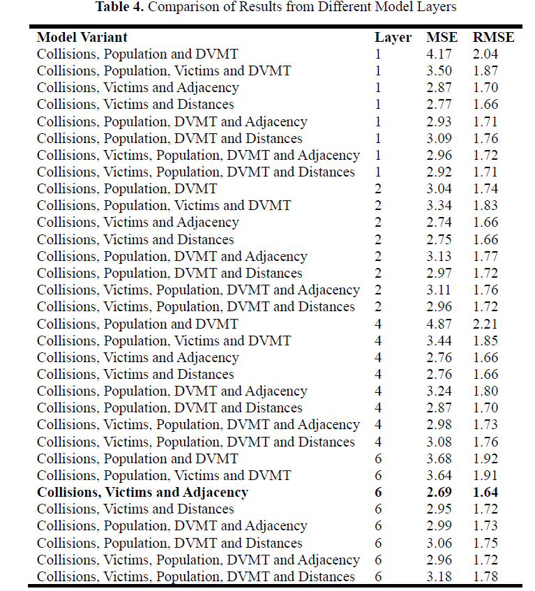
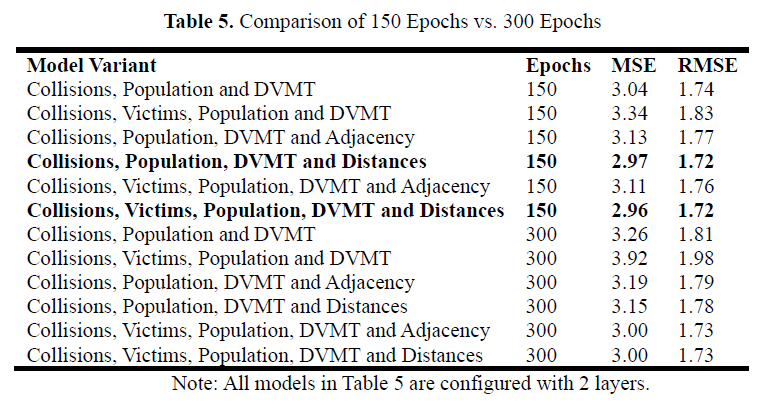

# Spatial-Proximity Integration in Transformer Based Models for County-Level Collision Prediction

This repository contains the implementation of a Transformer-based model for predicting traffic collisions at the county level, incorporating spatial proximity data. The model leverages adjacency and distance information from 58 California counties to enhance predictive accuracy. Original paper can be found via [link]().

## Project Overview

The study focuses on understanding how spatial proximity affects traffic crash prediction by:

- Integrating collision, victim, demographic, and spatial variables
- Evaluating the impact of adjacency and distance data
- Comparing different model architectures and training parameters
- Providing a framework for future traffic safety studies using machine learning

## Requirements

- Python 3.8+
- Jupyter Notebook
- Required Python packages (list to be added in requirements.txt)

## Project Structure

```
.
├── project_adj.ipynb    # Notebook for adjacency data preparation
├── project_dist.ipynb   # Notebook for distance data preparation
├── train.py            # Main training script
├── README.md
├── data               # Data directory
|    └── your_data
└── figures               # Figure directory
    └── figures.png
```

## Setup and Installation

1. Clone the repository:

```bash
git clone https://github.com/penny5283/Collision-Prediction-with-Transformer.git
cd Collision-Prediction-with-Transformer
```

2. Install required packages:

```bash
pip install -r requirements.txt
```

## Usage

1. Prepare the dataset:
   - Data collection and preparation to have your own `data`.
   - Run `project_adj.ipynb` and `project_dist.ipynb` to prepare the training dataset (be sure the modify the `data` path)
   - You can modify the following parameters to include/exclude features:
     - `add_adj`: Include adjacency features (True/False)
     - `add_dvmt`: Include DVMT features (True/False)
     - `add_popu`: Include population features (True/False)
     - `add_vict`: Include victim features (True/False)

2. Train the model:
   - Execute `train.py` to train the model with the prepared dataset

## Key Findings

- Models incorporating spatial features (adjacency and distance data) consistently outperform baseline models using only collision data
- Optimal performance achieved with:
  - Two-layer model architecture
  - 150 epochs (performing better than 300 epochs)
  - Integration of spatial proximity features

## Training Loss

- 6 Layers with Collisions, Victims and **Adjacency**, MSE: 2.686


- 6 Layers with Collisions, Victims and **Distances**, MSE: 2.948


## Results





## Citation

If you use this code or methodology in your research, please cite:

```bibtex
[Citation information will added soon]
```

## Contributing

Contributions are welcome! Please feel free to submit a Pull Request.

## License

[MIT LICENSE](./LICENSE)
